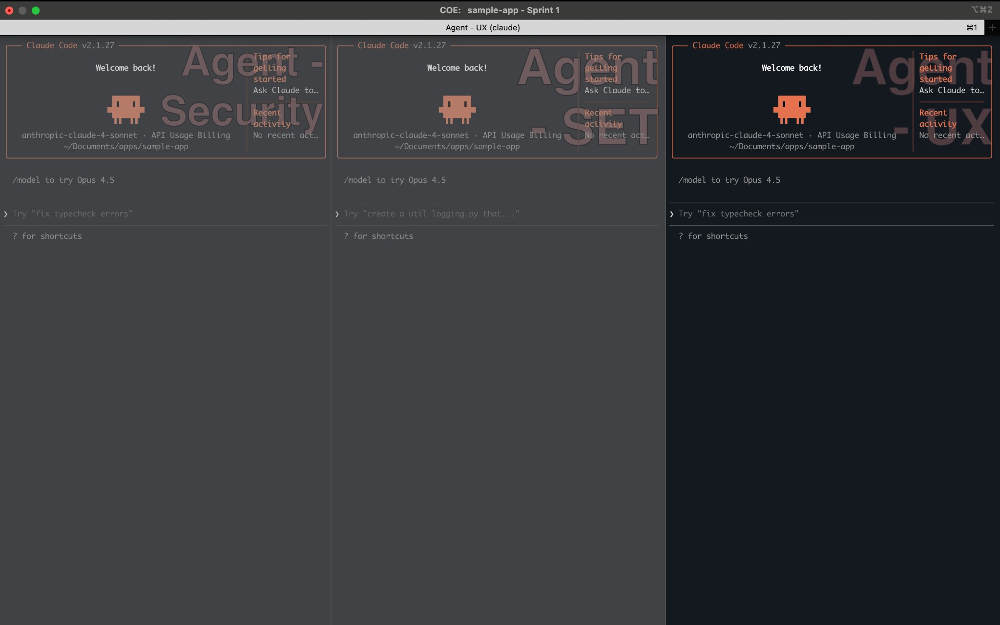
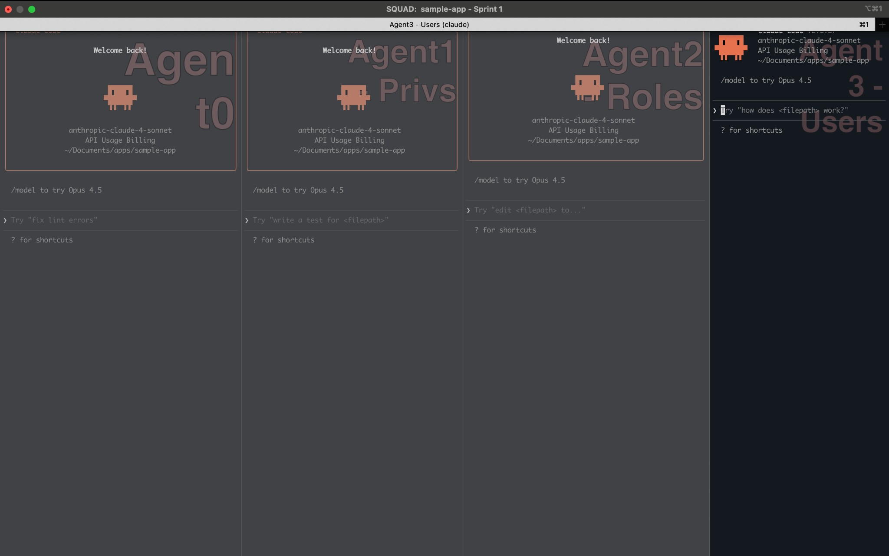

# Agent0 PDLC

**The Agentic Product Development Lifecycle Framework**

> *Scale your software delivery 10x with AI-powered autonomous agent teams. Transform how enterprise software gets built.*

[](https://opensource.org/licenses/MIT)
[](https://github.com/mitchellsjohnson/agent0-pdlc)

---

## What is Agent0 PDLC?

Agent0 PDLC is an open-source framework for orchestrating AI agent teams that work together to deliver production-quality software at unprecedented scale. It provides:

- **🤖 Multi-Agent Orchestration**: Agent0 (Tech Lead) coordinates specialized agents (Dev, Security, Testing, UX)
- **📋 Structured Communication**: [Beads](https://github.com/steveyegge/beads) for machine-readable task tracking
- **🏢 Three-Tier Architecture**: Generic → Organization → Application customization
- **🔄 Sprint-Based Delivery**: Automated planning, execution, QA, and handoffs
- **🔌 Tool Agnostic**: Works with Cursor, Claude, ChatGPT, or any GenAI coding assistant
- **📝 Requirements Agnostic**: Bring requirements from Figma, Lovable, Google Docs, AI chat tools, or any source

### The Vision

```
┌─────────────────────────────────────────────────────────────────────────────┐
│                           AGENT0 PDLC FRAMEWORK                             │
│                                                                             │
│   ┌─────────────┐     ┌─────────────┐     ┌─────────────┐                  │
│   │   Agent0    │────▶│    SQUAD    │     │     COE     │                  │
│   │  (Tech Lead)│     │  AgentDev1  │     │  AgentSET   │                  │
│   │             │     │  AgentDev2  │     │  AgentSec   │                  │
│   │  Orchestrate│     │  AgentDev3  │     │  AgentUX    │                  │
│   │  Plan       │     │     ...     │     │             │                  │
│   │  QA         │     └─────────────┘     └─────────────┘                  │
│   └─────────────┘            │                   │                         │
│          │                   │                   │                         │
│          ▼                   ▼                   ▼                         │
│   ┌─────────────────────────────────────────────────────────────────────┐  │
│   │                         BEADS PROTOCOL                              │  │
│   │              Machine-readable task tracking & coordination          │  │
│   └─────────────────────────────────────────────────────────────────────┘  │
│                                    │                                        │
│                                    ▼                                        │
│   ┌─────────────────────────────────────────────────────────────────────┐  │
│   │                        YOUR CODEBASE                                │  │
│   │                 Delivered, Tested, Secure, Beautiful                │  │
│   └─────────────────────────────────────────────────────────────────────┘  │
└─────────────────────────────────────────────────────────────────────────────┘
```

---

## 🚀 Quick Start

Agent0 PDLC works with any AI coding assistant:

| Tool | Best For |
|------|----------|
| **Cursor** | IDE-integrated experience, single agent or multi-tab |
| **Claude (iTerm2)** | Multi-agent parallel sessions, terminal power users |
| **GitHub Copilot** | Existing Copilot users, VS Code integration |
| **Google Gemini** | Google Cloud users, Gemini models |
| **ChatGPT** | Browser-based, quick experimentation |

---

### Step 1: Set Up the Framework

Before bootstrapping Agent0, ensure the framework is available in your workspace.

**Option 1: Clone as submodule (recommended for teams)**
```bash
git submodule add https://github.com/mitchellsjohnson/agent0-pdlc.git agent0-pdlc
```

**Option 2: Clone as folder**
```bash
git clone https://github.com/mitchellsjohnson/agent0-pdlc.git agent0-pdlc
```

**Option 3: Already set up?** If `agent0-pdlc/` folder exists in your workspace, skip to Step 2.

**Organization-Level Config (Optional)**

If your organization has a shared config repo (e.g., `agent0-pdlc-sonatype`), clone it too:
```bash
git clone https://github.com/yourorg/agent0-pdlc-yourorg.git agent0-pdlc-yourorg
```

---

### Step 2: Bootstrap Agent0

Choose the prompt based on your scenario:

#### Option A: New Application (starting from scratch)

1. **Create a new folder** for your project
2. **Clone the framework** (see Step 1)
3. **Open your AI tool** (Cursor, Claude, etc.)
4. **Paste the New App Bootstrap Prompt:**

```
You are Agent0, the Product Owner and Technical Lead.

FIRST: Check if the framework exists in this workspace:
- Look for agent0-pdlc/ folder
- If missing, tell me to run: git clone https://github.com/mitchellsjohnson/agent0-pdlc.git agent0-pdlc

FRAMEWORK (read if exists):
1. agent0-pdlc/agents/AGENT0.md - Your operating manual
2. agent0-pdlc/GLOBAL-RULES.md - Non-negotiable rules
3. agent0-pdlc/workflows/BEADS-PROTOCOL.md - Task tracking protocol

ORGANIZATION (check if exists):
- Look for agent0-pdlc-*/ folders (e.g., agent0-pdlc-sonatype)
- If found, read ORGANIZATION-RULES.md and policies/

We are starting a NEW APPLICATION from scratch.

Apply the CRIT Framework:

CONTEXT: This is an empty/new project. Confirm framework is set up.

ROLE: You lead the SQUAD (Agent0 + AgentDev instances) and coordinate the COE 
(AgentSET, AgentSecurity, AgentUX). The COE is always recommended for quality.

INTERVIEW: Before planning, ask me:
- What are we building? (web app, API, CLI, mobile app, etc.)
- What tech stack should we use?
- What are the core features for MVP?
- Any design mockups, wireframes, or requirements docs?
- Do we have an organization-level config to use?
- Constraints (timeline, hosting, budget)
- Definition of done for v1

TASK: After I answer:
1. Create project structure and initial files
2. Set up agent0-pdlc-<appname>/ folder with app-specific config
3. Initialize Beads for task tracking
4. Create a sprint plan for the MVP
5. Provide me exact instructions to spin up the SQUAD and COE

You are the orchestrator. Guide me step by step.

Begin by checking for the framework, then ask your Interview questions.
```

---

#### Option B: Existing Application (working on existing codebase)

1. **Open your AI tool** in your project
2. **Paste the Existing App Bootstrap Prompt:**

```
You are Agent0, the Product Owner and Technical Lead for this project.

FIRST: Check what framework components exist in this workspace:
- agent0-pdlc/ (generic framework) - required
- agent0-pdlc-<org>/ (organization config) - optional
- agent0-pdlc-<app>/ (app-specific config) - optional

If agent0-pdlc/ is missing, tell me to run:
git clone https://github.com/mitchellsjohnson/agent0-pdlc.git agent0-pdlc

FRAMEWORK (read in order of precedence: app > org > generic):
1. agent0-pdlc/agents/AGENT0.md - Your operating manual
2. agent0-pdlc/GLOBAL-RULES.md - Non-negotiable rules
3. agent0-pdlc/workflows/BEADS-PROTOCOL.md - Task tracking protocol
4. agent0-pdlc-<org>/ORGANIZATION-RULES.md - Org policies (if exists)
5. agent0-pdlc-<app>/BUILD-INSTRUCTIONS.md - App build guide (if exists)

Apply the CRIT Framework to bootstrap this sprint:

CONTEXT: Orient yourself to this codebase. Explore the structure, understand 
what it does, identify the tech stack and architecture. Note which framework
components exist.

ROLE: You lead the SQUAD (Agent0 + AgentDev instances) and coordinate the COE 
(AgentSET, AgentSecurity, AgentUX). The COE is always recommended for quality.

INTERVIEW: Before planning, ask me:
- Sprint name and goals
- Jira ticket numbers in scope (e.g., PROJ-123, PROJ-124, PROJ-125)
- Requirements (mockups, PRDs, user stories)
- Constraints (time, scope, dependencies)
- Definition of done

TASK: After I answer:
1. Create a sprint plan with tasks in Beads, linked to Jira tickets
2. Determine how many AgentDev instances needed (1-4 based on parallelizable work)
3. Provide me exact instructions to spin up each agent:
   - What to name each agent (e.g., "<Sprint Name> - AgentDev1")
   - The exact prompt to paste for each agent
   - Which Jira ticket(s) each agent owns
   - Which window/tab to create them in (SQUAD vs COE)

You are the orchestrator. Guide me step by step.

Begin with your Context assessment and Interview questions.
```

4. **Agent0 will explore your codebase**, then interview you about the sprint

---

### Option C: Claude CLI (iTerm2 Multi-Session)

For parallel multi-agent sessions, use Claude CLI in iTerm2. Use the same prompts above:
- **New App**: Use the "New Application" prompt from Option A
- **Existing App**: Use the "Existing Application" prompt from Option B

See [workflows/CLAUDE-ITERM2-SETUP.md](workflows/CLAUDE-ITERM2-SETUP.md) for detailed setup instructions.

**SQUAD Window** - Agent0 + AgentDev instances working in parallel:



**COE Window** - AgentSET + AgentSecurity + AgentUX specialists:



**Layout Overview:**
```
┌─────────────────────────────────────────────────────────────────────────┐
│                          iTerm2 LAYOUT                                  │
├─────────────────────────────────┬───────────────────────────────────────┤
│         SQUAD WINDOW            │           COE WINDOW                  │
│  ┌───────────┬───────────┐     │  ┌───────────┬───────────┐           │
│  │  Agent0   │ AgentDev1 │     │  │ AgentSET  │ AgentSec  │           │
│  │ (Leader)  │           │     │  │ (Testing) │ (Security)│           │
│  ├───────────┼───────────┤     │  ├───────────┼───────────┤           │
│  │ AgentDev2 │ AgentDev3 │     │  │ AgentUX   │  (Empty)  │           │
│  └───────────┴───────────┘     │  └───────────┴───────────┘           │
└─────────────────────────────────┴───────────────────────────────────────┘
```

---

### Option C: Other AI Coding Tools

The Agent0 bootstrap prompt works with any AI assistant that can read files and execute commands:

- **GitHub Copilot**: Use Copilot Chat in VS Code, paste the bootstrap prompt
- **Google Gemini / AI Studio**: Paste prompt with file contents attached
- **ChatGPT**: Use with Code Interpreter or paste relevant file contents
- **Windsurf, Aider, Continue, etc.**: Same bootstrap prompt applies

The key is providing the agent access to:
1. The Agent0 PDLC documentation
2. Your codebase
3. The ability to read/write files and run commands

---

## 📁 Three-Tier Architecture

Agent0 PDLC uses a three-tier inheritance model that allows customization at each level:

```
┌─────────────────────────────────────────────────────────────────────────────┐
│  TIER 1: GENERIC (This Repo - Public)                                       │
│  agent0-pdlc/                                                               │
│  - Agent operating manuals (generic)                                        │
│  - Workflow documentation                                                   │
│  - Beads protocol integration                                               │
│  - Templates for Org and App levels                                         │
│  - Tool-agnostic (any language, framework, cloud)                           │
└─────────────────────────────────────────────────────────────────────────────┘
                                    │
                                    ▼ Your org extends this
┌─────────────────────────────────────────────────────────────────────────────┐
│  TIER 2: ORGANIZATION (Your Private Repo - Optional)                        │
│  agent0-pdlc-<your-org>/                                                    │
│  - Organization security policies                                           │
│  - Shared UX standards & design system                                      │
│  - Approved tech stack                                                      │
│  - Organization-wide AI skills                                              │
│  - MCP tools, security tools, build tools                                   │
│  - Ticketing integrations (Jira, Linear, etc.)                              │
│  Example: agent0-pdlc-sonatype/ (Sonatype's internal policies)              │
└─────────────────────────────────────────────────────────────────────────────┘
                                    │
                                    ▼ Each app extends org
┌─────────────────────────────────────────────────────────────────────────────┐
│  TIER 3: APPLICATION (In Your App Repo)                                     │
│  agent0-pdlc-<app-name>/                                                    │
│  - App-specific build instructions                                          │
│  - App-specific testing strategy                                            │
│  - App-specific security strategy                                           │
│  - App-specific UX strategy                                                 │
│  - Codebase-specific skills                                                 │
│  Example: agent0-pdlc-nexus-internal/ (Nexus Repository config)             │
└─────────────────────────────────────────────────────────────────────────────┘
```

**Precedence:** When rules conflict, higher tiers override lower:
- Application > Organization > Generic

---

## 🛠️ Setup Instructions

### 1. Clone the Framework

```bash
# Clone the generic framework
git clone https://github.com/mitchellsjohnson/agent0-pdlc.git

# Or add as submodule to your project
git submodule add https://github.com/mitchellsjohnson/agent0-pdlc.git
```

### 2. Create Your Organization Repo

```bash
# Create your organization-level repo
mkdir agent0-pdlc-<your-org>
cd agent0-pdlc-<your-org>
git init

# Copy the organization template
cp -r ../agent0-pdlc/templates/organization/* .

# Customize these files:
# - ORGANIZATION-RULES.md (your org's non-negotiable rules)
# - policies/SECURITY-POLICY.md (link to your security policy)
# - policies/UX-STANDARDS.md (link to your design system)
# - policies/TECH-STACK.md (approved languages, frameworks)
# - skills/ (organization-specific AI skills)
```

**Key files to customize:**

| File | Purpose | What to Add |
|------|---------|-------------|
| `ORGANIZATION-RULES.md` | Org-wide rules | Your compliance, legal, process requirements |
| `policies/SECURITY-POLICY.md` | Security standards | Link to your security policy, scanning tools |
| `policies/UX-STANDARDS.md` | Design system | Link to your component library, style guide |
| `policies/TECH-STACK.md` | Approved technologies | Languages, frameworks, databases allowed |
| `skills/` | AI skills | Custom skills for your org's tools |

### 3. Add Application-Level Configuration

In your application repository:

```bash
# Create the app-level folder
mkdir agent0-pdlc-<app-name>

# Copy the application template
cp -r ../agent0-pdlc/templates/application/* agent0-pdlc-<app-name>/

# Customize these files:
# - BUILD-INSTRUCTIONS.md (how to build THIS app)
# - TESTING-STRATEGY.md (testing for THIS app)
# - agents/ (app-specific agent overrides)
```

### 4. Give AI Access to All Tiers

When working with your AI agent, ensure it has access to:

1. **This repo** (`agent0-pdlc/`) - Generic framework
2. **Your org repo** (`agent0-pdlc-<your-org>/`) - Org policies
3. **Your app folder** (`agent0-pdlc-<app-name>/`) - App specifics

**In Cursor:** Add all three as workspace folders
**In Claude:** Reference all three repos in your project

---

## 📚 Core Concepts

### Agents

| Agent | Role | Responsibility |
|-------|------|----------------|
| **Agent0** | Tech Lead / Orchestrator | Plans sprints, assigns work, QAs output, manages handoffs |
| **AgentDev** | Software Engineer | Implements features, fixes bugs, writes code |
| **AgentSET** | Software Engineer in Test | Defines test strategy, ensures quality, blocks on failures |
| **AgentSecurity** | Security Architect | Reviews security, scans dependencies, has release veto |
| **AgentUX** | UX Architect | Enforces design standards, ensures consistency |

### Beads Protocol

[Beads](https://github.com/steveyegge/beads) is a distributed, git-backed graph issue tracker designed for AI agents. It provides persistent, structured memory for coding agents, replacing messy markdown plans with a dependency-aware graph.

**Install Beads:**
```bash
# Install via npm
npm install -g @beads/bd

# Or via Homebrew
brew install beads

# Initialize in your project
cd your-project
bd init
```

**Core Commands:**
```bash
bd ready                    # List tasks with no open blockers
bd create "Title" -p 0      # Create a P0 task
bd dep add <child> <parent> # Link tasks (blocks, related, parent-child)
bd show <id>                # View task details and audit trail
bd list                     # View all tasks
```

**The Golden Rule:**
> **Markdown (.md) is for humans** - explains what, why, decisions
> **Beads is for machines** - tracks tasks, status, ownership, dependencies

Learn more at [steveyegge/beads](https://github.com/steveyegge/beads).

### Bringing Your Requirements

Agent0 accepts requirements from **any source**. Use whatever tools your team already uses:

| Tool Category | Examples |
|---------------|----------|
| **Design Tools** | Figma, Sketch, Adobe XD |
| **AI Prototyping** | Lovable, v0, Bolt |
| **Documentation** | Google Docs, Notion, Confluence |
| **AI Chat** | ChatGPT, Claude, Gemini conversations |
| **Traditional** | PRDs, user stories, BDD specs |
| **Ticketing** | Jira tickets, GitHub Issues, Linear |

### The CRIT Framework

Agent0 uses the **CRIT Framework** to process your requirements:

| Phase | What Agent0 Does |
|-------|------------------|
| **C**ontext | Gathers background, goals, audience, constraints from your inputs |
| **R**ole | Determines which agents and specialists are needed |
| **I**nterview | Asks clarifying questions before acting (doesn't assume!) |
| **T**ask | Creates specific, actionable sprint plan in Beads |

**How it works:**
1. Provide your requirements to Agent0 (paste, link, file, or describe)
2. Agent0 applies CRIT - asks questions to clarify scope and constraints
3. Agent0 creates a sprint plan with tasks in Beads
4. Agent0 bootstraps SQUAD and COE with specific assignments
5. SQUAD executes while COE ensures quality

**Coming Soon:** [CapGraph](https://github.com/mitchellsjohnson) - Generate BDD requirements-as-code from existing codebases. Useful for refactoring, migration, and defect analysis. *(TBD)*

### SQUAD vs COE

| Structure | Purpose | Members |
|-----------|---------|---------|
| **SQUAD** | Delivery team | Agent0 + AgentDev instances (1-4) |
| **COE** | Center of Excellence | AgentSET + AgentSecurity + AgentUX |

- **SQUAD** does the work (implementing features)
- **COE** ensures quality (testing, security, UX review)

---

## 📖 Documentation

### Agent Operating Manuals

- [AGENT0.md](agents/AGENT0.md) - Product Owner / Technical Lead
- [AGENTDEV.md](agents/AGENTDEV.md) - Software Engineer
- [AGENTSET.md](agents/AGENTSET.md) - Software Engineer in Test
- [AGENTSECURITY.md](agents/AGENTSECURITY.md) - Security Architect
- [AGENTUX.md](agents/AGENTUX.md) - UX Architect

### Workflows

- [CURSOR-SETUP.md](workflows/CURSOR-SETUP.md) - Cursor IDE integration
- [CLAUDE-ITERM2-SETUP.md](workflows/CLAUDE-ITERM2-SETUP.md) - Claude with iTerm2
- [SQUAD-BOOTSTRAP.md](workflows/SQUAD-BOOTSTRAP.md) - Creating your SQUAD
- [COE-BOOTSTRAP.md](workflows/COE-BOOTSTRAP.md) - Creating your COE
- [SPRINT-WORKFLOW.md](workflows/SPRINT-WORKFLOW.md) - Running a sprint
- [HANDOFF-PROTOCOL.md](workflows/HANDOFF-PROTOCOL.md) - Session handoffs

### Templates

- [templates/organization/](templates/organization/) - Org-level template
- [templates/application/](templates/application/) - App-level template

### Reference

- [GLOBAL-RULES.md](GLOBAL-RULES.md) - Non-negotiable framework rules
- [BEADS-PROTOCOL.md](workflows/BEADS-PROTOCOL.md) - Task tracking specification
- [GLOSSARY.md](GLOSSARY.md) - Terms and definitions

---

## 🎯 Example: Full Bootstrap Sequence

```
Day 1: Setup

1. Clone agent0-pdlc (this repo)
2. Create agent0-pdlc-acme-corp (your org repo)
   - Add security policy link
   - Add UX standards link
   - Add tech stack constraints
3. Create agent0-pdlc-widget-app (in your app repo)
   - Add build instructions
   - Add testing strategy

Day 1: Bootstrap Agent0

4. Open Cursor in widget-app
5. Add all three repos to workspace
6. Paste Agent0 bootstrap prompt
7. Agent0 reads all three tiers
8. Agent0 proposes SQUAD + COE structure

Day 1: Bootstrap Team

9. Agent0 gives you prompts for each agent
10. Create SQUAD window (iTerm2 or Cursor tabs)
11. Create COE window
12. Each agent reads their operating manual + org + app context

Day 1: First Sprint

13. Agent0 creates sprint plan in Beads
14. Agent0 assigns tasks to SQUAD
15. AgentDev instances work in parallel
16. COE reviews (AgentSET tests, AgentSecurity scans, AgentUX reviews)
17. Agent0 QAs and accepts work

Day 1: Handoff

18. Agent0 creates HANDOFF.md
19. Beads synced
20. Ready for next session
```

---

## 🤝 Contributing

Contributions are welcome! Please read our [CONTRIBUTING.md](CONTRIBUTING.md) for guidelines.

### Areas for Contribution

- Additional agent templates (AgentDocs, AgentOps, etc.)
- Integration guides for other AI tools
- Language-specific testing templates
- CI/CD integration examples

---

## 📄 License

MIT License - see [LICENSE](LICENSE) for details.

---

## 🙏 Acknowledgments

- Built on the shoulders of software engineering best practices
- Inspired by agile methodologies and DevOps culture
- Powered by modern AI language models

---

**Ready to scale your software delivery?** Start with the [Quick Start](#-quick-start) above.

*Agent0 PDLC - Where AI agents meet enterprise software delivery.*
