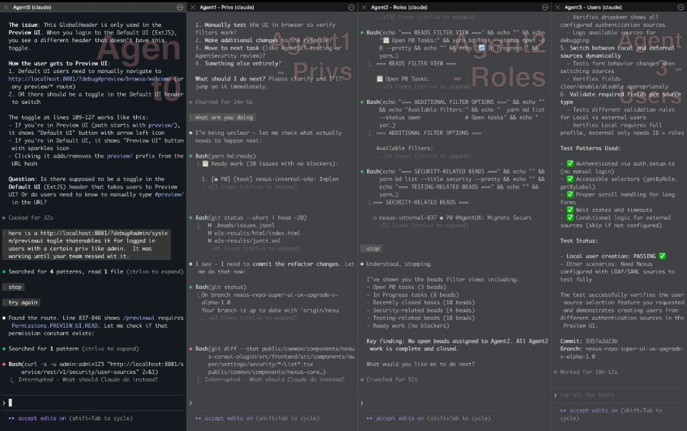
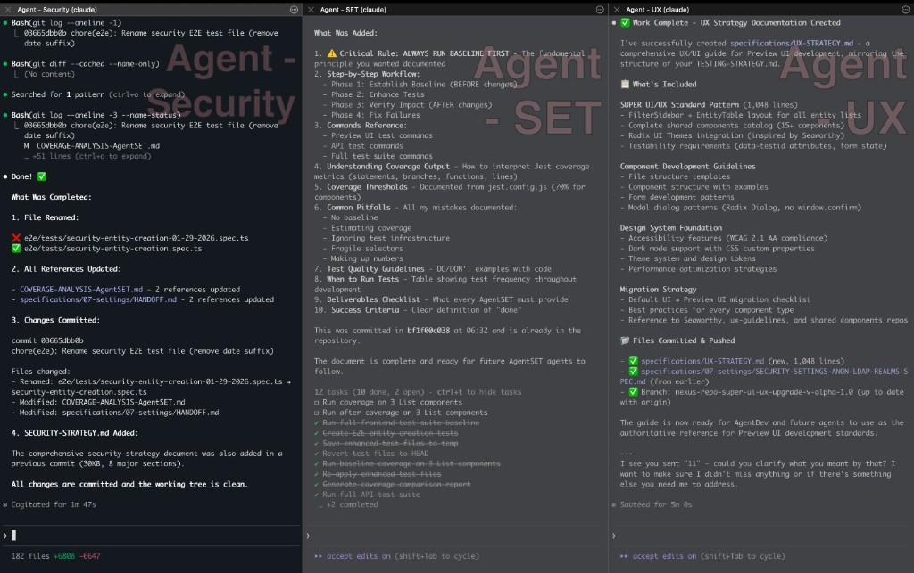

# Claude + iTerm2 Multi-Session Setup

This guide explains how to run Agent0 PDLC with Claude CLI in iTerm2 using multiple terminal sessions for parallel agent work.

---

## Overview

The recommended layout uses **two iTerm2 windows**: SQUAD and COE.

### SQUAD Window - Fresh Setup


### COE Window - Fresh Setup


### SQUAD Window - Working Session



### COE Window - Working Session



---

## Layout Details

The recommended layout uses **two iTerm2 windows**:

```
┌─────────────────────────────────────────────────────────────────────────────┐
│                           WINDOW 1: SQUAD                                   │
│                                                                             │
│  ┌─────────────────────────────┬─────────────────────────────┐             │
│  │                             │                             │             │
│  │         Agent0              │        AgentDev1            │             │
│  │     (Tech Lead)             │    (Developer)              │             │
│  │                             │                             │             │
│  │  • Orchestrates             │  • Implements features      │             │
│  │  • Plans sprints            │  • Writes code              │             │
│  │  • QAs work                 │  • Follows Agent0           │             │
│  │                             │                             │             │
│  ├─────────────────────────────┼─────────────────────────────┤             │
│  │                             │                             │             │
│  │        AgentDev2            │        AgentDev3            │             │
│  │    (Developer)              │    (Developer)              │             │
│  │                             │                             │             │
│  │  • Implements features      │  • Implements features      │             │
│  │  • Parallel work            │  • Parallel work            │             │
│  │                             │                             │             │
│  └─────────────────────────────┴─────────────────────────────┘             │
└─────────────────────────────────────────────────────────────────────────────┘

┌─────────────────────────────────────────────────────────────────────────────┐
│                           WINDOW 2: COE                                     │
│         (Center of Excellence - Specialists)                                │
│                                                                             │
│  ┌─────────────────────────────┬─────────────────────────────┐             │
│  │                             │                             │             │
│  │        AgentSET             │      AgentSecurity          │             │
│  │    (Testing)                │    (Security)               │             │
│  │                             │                             │             │
│  │  • Test strategy            │  • Security review          │             │
│  │  • Quality gates            │  • Dependency scans         │             │
│  │  • Coverage                 │  • Release veto             │             │
│  │                             │                             │             │
│  ├─────────────────────────────┼─────────────────────────────┤             │
│  │                             │                             │             │
│  │        AgentUX              │       (Available)           │             │
│  │    (UX)                     │                             │             │
│  │                             │  • Empty pane for           │             │
│  │  • UX standards             │    additional agents        │             │
│  │  • Accessibility            │  • Or monitoring            │             │
│  │  • Consistency              │                             │             │
│  │                             │                             │             │
│  └─────────────────────────────┴─────────────────────────────┘             │
└─────────────────────────────────────────────────────────────────────────────┘
```

---

## Prerequisites

1. **iTerm2** installed ([download](https://iterm2.com/))
2. **Claude CLI** installed and configured
3. **Three-tier framework** in place:
   - `agent0-pdlc/` (generic)
   - `agent0-pdlc-<org>/` (organization)
   - `agent0-pdlc-<app>/` (application)

### Install Claude CLI

```bash
# Install via npm
npm install -g @anthropic-ai/claude-cli

# Or via Homebrew
brew install anthropic/tap/claude

# Configure API key
claude auth
```

---

## iTerm2 Setup

### Step 1: Create SQUAD Window

1. Open iTerm2
2. Create new window: `Cmd+N`
3. Name it "SQUAD": Right-click tab → Edit Tab Title
4. Split into 4 panes:
   - `Cmd+D` (split vertical)
   - `Cmd+Shift+D` (split horizontal) in each pane

### Step 2: Create COE Window

1. Create new window: `Cmd+N`
2. Name it "COE"
3. Split into 4 panes (same as above)

### Step 3: Save Window Arrangement

1. Window → Save Window Arrangement
2. Name it "Agent0-PDLC"

**To restore:** Window → Restore Window Arrangement → Agent0-PDLC

---

## Bootstrapping Agents

### Agent0 (SQUAD Window, Top-Left)

```bash
cd /path/to/your/app
claude

# Then paste:
```

```
You are Agent0, the Product Owner and Technical Lead for this project.

Read and internalize these documents in order:
1. agent0-pdlc/agents/AGENT0.md - Your operating manual
2. agent0-pdlc/GLOBAL-RULES.md - Non-negotiable rules
3. agent0-pdlc/workflows/BEADS-PROTOCOL.md - Communication protocol
4. agent0-pdlc-org/ORGANIZATION-RULES.md - Organization policies
5. agent0-pdlc-<app>/BUILD-INSTRUCTIONS.md - How to build this app

Your first task: Orient yourself to this codebase.

After reading, report:
1. Project understanding
2. Current state (HANDOFF.md, Beads)
3. Recommended SQUAD size
4. COE requirements
5. Proposed sprint scope

I am the human orchestrator. Once you report, I will bootstrap the other agents based on your recommendations.
```

### Wait for Agent0's Recommendations

Agent0 will analyze and recommend:
- SQUAD size (how many AgentDev)
- COE needs (which specialists)
- Sprint scope

---

### AgentDev1 (SQUAD Window, Top-Right)

```bash
cd /path/to/your/app
claude

# Then paste:
```

```
You are AgentDev1, a Software Engineer on this project.

Read and internalize:
1. agent0-pdlc/agents/AGENTDEV.md - Your operating manual
2. agent0-pdlc/GLOBAL-RULES.md - Non-negotiable rules
3. agent0-pdlc-org/ORGANIZATION-RULES.md - Org policies
4. agent0-pdlc-<app>/BUILD-INSTRUCTIONS.md - How to build

You report to Agent0. Pull tasks from Beads: yarn bd:ready

Your scope will be assigned by Agent0.

Acknowledge and await your first task.
```

### AgentDev2, AgentDev3 (SQUAD Window, Bottom Panes)

Same as AgentDev1, but change the name:
- `You are AgentDev2...`
- `You are AgentDev3...`

---

### AgentSET (COE Window, Top-Left)

```bash
cd /path/to/your/app
claude

# Then paste:
```

```
You are AgentSET, the Software Engineer in Test for this project.

Read and internalize:
1. agent0-pdlc/agents/AGENTSET.md - Your operating manual
2. agent0-pdlc/GLOBAL-RULES.md - Non-negotiable rules
3. agent0-pdlc-org/policies/TESTING-POLICY.md - Org testing policy
4. agent0-pdlc-<app>/TESTING-STRATEGY.md - App testing strategy

You advise Agent0 and review SQUAD work.
You have authority to block releases on quality grounds.

First task: Establish a testing baseline.
- Run the test suite
- Document current coverage
- Report gaps

Acknowledge and begin baseline assessment.
```

### AgentSecurity (COE Window, Top-Right)

```bash
cd /path/to/your/app
claude

# Then paste:
```

```
You are AgentSecurity, the Security Architect for this project.

Read and internalize:
1. agent0-pdlc/agents/AGENTSECURITY.md - Your operating manual
2. agent0-pdlc/GLOBAL-RULES.md - Non-negotiable rules
3. agent0-pdlc-org/policies/SECURITY-POLICY.md - Org security policy
4. agent0-pdlc-<app>/SECURITY-STRATEGY.md - App security strategy

You advise Agent0 and review SQUAD work.
You have release veto authority for security issues.

First task: Establish a security baseline.
- Scan dependencies
- Review recent code changes
- Report vulnerabilities

Acknowledge and begin baseline assessment.
```

### AgentUX (COE Window, Bottom-Left)

```bash
cd /path/to/your/app
claude

# Then paste:
```

```
You are AgentUX, the UX Architect for this project.

Read and internalize:
1. agent0-pdlc/agents/AGENTUX.md - Your operating manual
2. agent0-pdlc/GLOBAL-RULES.md - Non-negotiable rules
3. agent0-pdlc-org/policies/UX-STANDARDS.md - Org UX standards
4. agent0-pdlc-<app>/UX-STRATEGY.md - App UX strategy

You advise Agent0 and review SQUAD work.
You have authority to block releases on UX grounds.

First task: Review current UI for consistency.
- Check component usage
- Identify deviations
- Report UX debt

Acknowledge and begin baseline assessment.
```

---

## Workflow: Running a Sprint

### 1. Human Tells Agent0 the Goal

In Agent0's pane:
```
Our goal this sprint: [describe what you want to build]

Create a sprint plan with tasks assigned to the SQUAD.
Use Beads for tracking.
```

### 2. Agent0 Creates Plan in Beads

Agent0 will:
```bash
yarn bd create "Feature A" -t task -d "Details" --assign AgentDev1
yarn bd create "Feature B" -t task -d "Details" --assign AgentDev2
yarn bd create "Test coverage" -t task -d "Details" --assign AgentSET
```

### 3. Human Notifies Agents

In AgentDev1's pane:
```
Agent0 has assigned you a task. Check Beads: yarn bd:ready
```

In AgentDev2's pane:
```
Agent0 has assigned you a task. Check Beads: yarn bd:ready
```

### 4. Agents Work in Parallel

Each agent works independently in their pane.
They update Beads as they progress.

### 5. COE Reviews

When SQUAD finishes:

In AgentSET's pane:
```
AgentDev1 completed Feature A. Review the work:
- Run tests
- Check coverage
- Report to Agent0
```

In AgentSecurity's pane:
```
AgentDev2 completed Feature B. Review the work:
- Check for security issues
- Scan dependencies
- Report to Agent0
```

### 6. Agent0 Accepts

In Agent0's pane:
```
AgentSET and AgentSecurity have reviewed.
Accept the completed work and close tasks in Beads.
```

---

## Session Management

### Starting a New Session

1. Open iTerm2
2. Restore window arrangement
3. Bootstrap Agent0 first
4. Bootstrap other agents based on Agent0's recommendation

### Resuming a Session

In Agent0's pane:
```
Resume from previous session.
Read HANDOFF.md and Beads to understand current state.
Continue work from where we left off.
```

### Ending a Session

In Agent0's pane:
```
We're ending this session. Please:
1. Sync Beads: yarn bd:sync
2. Commit all changes
3. Create HANDOFF.md with:
   - What was delivered
   - Current state
   - Next priorities
   - SQUAD/COE status
4. Push to remote

All other agents: Save your state and await next session.
```

---

## Tips for Multi-Agent Coordination

### Communication Flow

```
Human ──▶ Agent0 ──▶ SQUAD (via Beads)
                 ──▶ COE (for reviews)
                 
COE ──▶ Agent0 ──▶ Human (for blockers/vetoes)
```

### Avoiding Conflicts

- Assign non-overlapping tasks
- Use Beads dependencies
- Have Agent0 coordinate file access
- COE reviews after SQUAD completes

### Monitoring Progress

In any pane, run:
```bash
yarn bd:list
```

Or ask Agent0:
```
Show me the current sprint status.
```

### Handling Blockers

If an agent is blocked:
```
I'm blocked on [issue]. Notifying Agent0.
```

Agent0 resolves or escalates to human.

---

## Troubleshooting

### Agent Lost Context

```
Your context may have been lost. Please re-read:
1. Your operating manual (agent0-pdlc/agents/AGENT[X].md)
2. HANDOFF.md
3. Current Beads status

Continue from current state.
```

### Agents Out of Sync

Have Agent0 coordinate:
```
Agent0, sync all agents:
1. Check Beads status
2. Identify conflicts
3. Resolve and reassign
```

### Too Many Agents

If context overwhelms:
- Reduce to 2 AgentDev
- Run COE reviews sequentially
- Use Agent0 more for direct work

---

## Advanced: Automation Script

Create `bootstrap-agents.sh`:

```bash
#!/bin/bash

PROJECT_DIR="/path/to/your/app"
ORG="your-org"
APP="your-app"

# SQUAD Window
osascript <<EOF
tell application "iTerm"
    create window with default profile
    tell current session of current window
        set name to "Agent0"
        write text "cd $PROJECT_DIR && claude"
    end tell
    -- Add more panes for AgentDev1, AgentDev2, etc.
end tell
EOF

# COE Window
osascript <<EOF
tell application "iTerm"
    create window with default profile
    tell current session of current window
        set name to "AgentSET"
        write text "cd $PROJECT_DIR && claude"
    end tell
    -- Add more panes for AgentSecurity, AgentUX
end tell
EOF

echo "Windows created. Paste bootstrap prompts manually."
```

---

## Summary

1. **Two windows**: SQUAD + COE
2. **Agent0 leads**: Always bootstrap first
3. **Beads coordinates**: All task tracking
4. **COE reviews**: Before accepting work
5. **Human orchestrates**: Tells Agent0 goals, resolves escalations
6. **Sessions saved**: HANDOFF.md + Beads sync + git push
